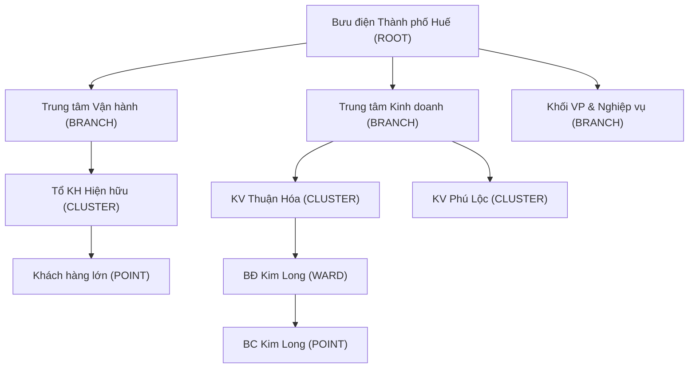

# AUDIT: DUAL CENTER HIERARCHY & ASSIGNMENT FLOW

**Mục tiêu:** Cập nhật chính xác hiện trạng Cây tổ chức với 2 nhánh Trung tâm độc lập và cách Scoping Engine kiểm soát luồng giao việc (Assign) + Action Center.

---

## 1. TOÀN BỘ CÂY TỔ CHỨC THẬT (DATABASE REALITY)

Cây tổ chức hiện tại trên Database bắt đầu từ Root (BĐTP) và rẽ ra làm 2 nhánh Trung tâm chính, cộng 1 nhánh Khối văn phòng.

| Tầng (Level) | Loại Node (Type) | Ví dụ thực tế trong DB |
|---|---|---|
| 0 | `ROOT` | Bưu điện Thành phố Huế |
| 1 | `BRANCH` | Trung tâm Kinh doanh (TTKD), Trung tâm Vận hành (TTVH) |
| 2 | `CLUSTER` | Tổ KH Hiện hữu (TTVH), Khu vực Thuận Hóa (TTKD) |
| 3 | `WARD` | Bưu điện phường Kim Long |
| 4 | `POINT` | Bưu cục Kim Long, Khách hàng lớn |
| *Staff* | *NhanSu* | Liên kết 1-1 vào `POINT` (point_id) |

---

## 2. TÁCH BIỆT 2 NHÁNH TRUNG TÂM

| Nội dung | Trung tâm KD (TTKD) | Trung tâm VH (TTVH) |
|---|---|---|
| **Thấy dữ liệu gì** | Toàn bộ Khách hàng, Giao dịch có `point_id` thuộc cây TTKD | Khách hàng, Giao dịch có `point_id` thuộc cây TTVH |
| **Thấy node nào** | Từ nhánh TTKD đổ xuống | Từ nhánh TTVH đổ xuống |
| **Giao việc cho ai** | Staff thuộc TTKD | Staff thuộc TTVH |
| **Thấy cây của nhau?** | ❌ KHÔNG | ❌ KHÔNG |
| **Scope hierarchy** | Chỉ quyét nhánh TTKD | Chỉ quyét nhánh TTVH |

---

## 3. FLOW GIAO VIỆC HIỆN TẠI THẬT SỰ

- **Đích đến (Target):** Luôn giao cho **STAFF** (Nhân sự) thông qua `staff_id`.
- **Logic chọn (UI Routing):** Khi click Assign, Backend dò giao dịch cuối của khách hàng để ra `point_id` $\rightarrow$ truy ngược lên `CLUSTER` $\rightarrow$ lấy toàn bộ WARD/POINT/STAFF trong Cluster đó để Frontend hiện Dropdown.
- **Giới hạn nhiều tầng?** Chưa. Chỉ giao thẳng (Direct Assign) từ Người giao $\rightarrow$ Nhân viên. Không có chức năng "Giao cho Bưu cục trưởng để tự chia".

---

## 4. SCOPING ENGINE (CƠ CHẾ LÕI)

Cơ chế phân quyền dùng hàm `ScopingService.get_effective_scope_ids` dựa hoàn toàn vào `user.scope_node_id` và đệ quy xuống.

| User | Giá trị `scope_node_id` | Thấy gì (Scope) |
|---|---|---|
| **GĐ BĐTP (Admin)** | `None` (Null) | Toàn quyền. Thấy toàn bộ cây TTKD + TTVH. |
| **GĐ TTKD** | `ID của nhánh TTKD` | Thấy toàn bộ Cụm, Phường, Bưu cục, Nhân viên thuộc TTKD. Bị mù với TTVH. |
| **GĐ TTVH** | `ID của nhánh TTVH` | Thấy nhánh TTVH (Ví dụ: Tổ KH Hiện hữu). Bị mù với TTKD. |
| **Trưởng Cụm** | `ID của CLUSTER` | Thấy các WARD, POINT thuộc Cụm của mình. |
| **Trưởng P/X** | `ID của WARD` | Chỉ thấy POINT thuộc Phường/Xã mình. |

---

## 5. ACTION CENTER IMPACT

- **Luồng đọc (Read):** Action Center query task dựa trên `staff_id` $\rightarrow$ map với `point_id` $\rightarrow$ map với `scope_node_id`. 
- **Phân nhánh:** Đã phân biệt triệt để. User TTVH chỉ thấy Task của nhân viên TTVH. User TTKD chỉ thấy Task của nhân viên TTKD.
- **🚨 NGUY CƠ LỖI (Cross-center leakage):** API `/api/customers/staff-options` hiện tại gợi ý danh sách Staff dựa theo giao dịch cuối của Khách hàng, **CHƯA** lọc nghiêm ngặt theo `user.scope_node_id`. Nếu 1 khách hàng TTVH có giao dịch cũ ở TTKD, người dùng TTVH có thể vô tình nhìn thấy Dropdown chứa nhân viên TTKD và giao task cho họ. Khi giao xong, Task đó sẽ bay sang Action Center của TTKD và người giao (TTVH) sẽ mất dấu task vĩnh viễn (Vì ngoài scope).

---

## 6. UI REALITY vs BACKEND CAPABILITY

Bảng đối chiếu độ lệch giữa Backend và Frontend hiện hành:

| Thành phần | Backend đã có (API/DB) | UI đã có (Frontend) | Đánh giá |
|---|---|---|---|
| **Hierarchy tree** | ✅ Có 2 nhánh TTVH, TTKD | ⚠️ Chỉ mới hiển thị Ward / Point trên dropdown Modal. | UX chưa rõ ràng sự tách biệt Trung tâm. |
| **Multi-center scope** | ✅ Chặn chặt qua `scope_node_id` | ✅ Tuân thủ đúng dữ liệu trả về. | Tốt. |
| **Drilldown assign** | ✅ Trả list staff theo point | ✅ Disable Dropdown WARD nếu là Trưởng P/X. | Tốt. |
| **Assign theo leader** | ❌ Chưa có. Chỉ lưu staff_id. | ❌ Chưa có. | Backend chưa hỗ trợ giao cho Node (Bưu cục). |
| **Cross-center restriction**| ⚠️ Lỏng lẻo ở hàm lấy staff gợi ý | ❌ Hiển thị tất cả staff do backend trả | **Rủi ro mất Task**. Cần fix API `staff-options`. |
