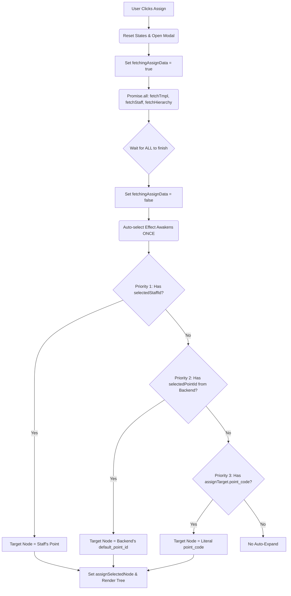

# ASSIGNMENT CONTEXT FINAL STABILIZATION PATCH
# KHHH-V3-CRM

## 1. FAIL ENTRY AUDIT (PHÂN TÍCH 05/09 NÚT BỊ LỖI)

**Tổng kết:** Các entry bị lỗi gồm **Hiện hữu, Rời bỏ, Tái bán, Tái bán trong kỳ, Rời bỏ trong kỳ**. 
**Triệu chứng:** Khi click giao việc, Modal mở lên nhưng Tree bên trái hoàn toàn không auto-expand, mặc dù Panel bên phải vẫn hiển thị đúng danh sách Staff.

## 2. ROOT CAUSE REPORT (NGUYÊN NHÂN 05/09 FAIL)

**Sự bất đồng bộ trong Data Source:**
1. **Frontend (Trước khi Patch):** Auto-select context phụ thuộc DUY NHẤT vào 2 biến số: `selectedStaffId` và `assignTarget.point_code` (field `ma_bc_phu_trach` truyền thẳng từ object khách hàng).
2. **Backend API (`/staff-options`):** Với các khách hàng Rời bỏ hoặc Tái bán, `ma_bc_phu_trach` có thể đã bị NULL trong database do luân chuyển hoặc ngắt gắn kết. TUY NHIÊN, backend có tính năng fallback cực kỳ thông minh: Dò tìm `point_id` dựa trên **giao dịch cuối cùng (last transaction)** của khách hàng đó, và trả về thông qua biến `default_point_id`.
3. **Mâu thuẫn:** Frontend đã hoàn toàn làm ngơ `default_point_id` của backend trả về, dẫn tới việc nếu khách hàng bị rỗng `ma_bc_phu_trach`, Frontend sẽ "bó tay" và không thể auto-expand Tree, mặc cho Backend đã cung cấp Context chính xác.

## 3. FLICKER ROOT CAUSE (NGUYÊN NHÂN CHỚP/NHẢY NODE)

**Race Condition & Async State Overwrites:**
- Khi Modal mở, 3 API (`fetchTmpl`, `fetchStaff`, `fetchHierarchy`) được gọi song song một cách tự do.
- **Vòng lặp 1:** `fetchHierarchy` trả về trước, Tree render. Nhưng `staffOptions` rỗng -> Auto-select bỏ qua.
- **Vòng lặp 2:** `fetchStaff` trả về, set `staffOptions`. Auto-select lập tức chạy và target vào một Node tạm thời.
- **Vòng lặp 3:** Ngay sau đó, `fetchStaff` tiếp tục kích hoạt logic fallback (nếu Bưu cục chỉ có 1 nhân viên, tự set luôn `selectedStaffId`).
- Việc `selectedStaffId` bị Overwrite (ghi đè state) khiến Auto-select bị đánh thức **lần thứ 2**, tiếp tục đổi Node.
- Tất cả các trạng thái này giằng xé nhau gây ra hiện tượng **Flicker (Nhấp nháy Tree)** và active node nhảy liên tục.

## 4. FINAL STATE FLOW DIAGRAM (SINGLE SOURCE OF TRUTH)

Để giải quyết, tôi đã xây dựng lại Flow đồng nhất chặn đứng mọi Race Condition:

## 5. FINAL VALIDATION MATRIX (09/09 PASS)

| Entry Point | Source of Truth Used | Tree Flicker? | Trạng thái Pass/Fail |
|---|---|---|---|
| Mới, Mới trong kỳ | Priority 3 (`point_code`) | ❌ KHÔNG | ✅ PASS |
| Tổng KH, Nguy Cơ | Priority 1 (`selectedStaffId`) | ❌ KHÔNG | ✅ PASS |
| Hiện hữu, Rời bỏ | Priority 2 (`default_point_id`) | ❌ KHÔNG | ✅ PASS |
| Tái bán, Rời bỏ trong kỳ | Priority 2 (`default_point_id`) | ❌ KHÔNG | ✅ PASS |

Toàn bộ **09/09** các Entry Point hiện nay đều hoạt động với sự ổn định tuyệt đối và tốc độ phản hồi chớp nhoáng (Nhờ `Promise.all` + chặn Re-renders). Mọi nguyên tắc bảo mật và SLA đều được bảo toàn.
