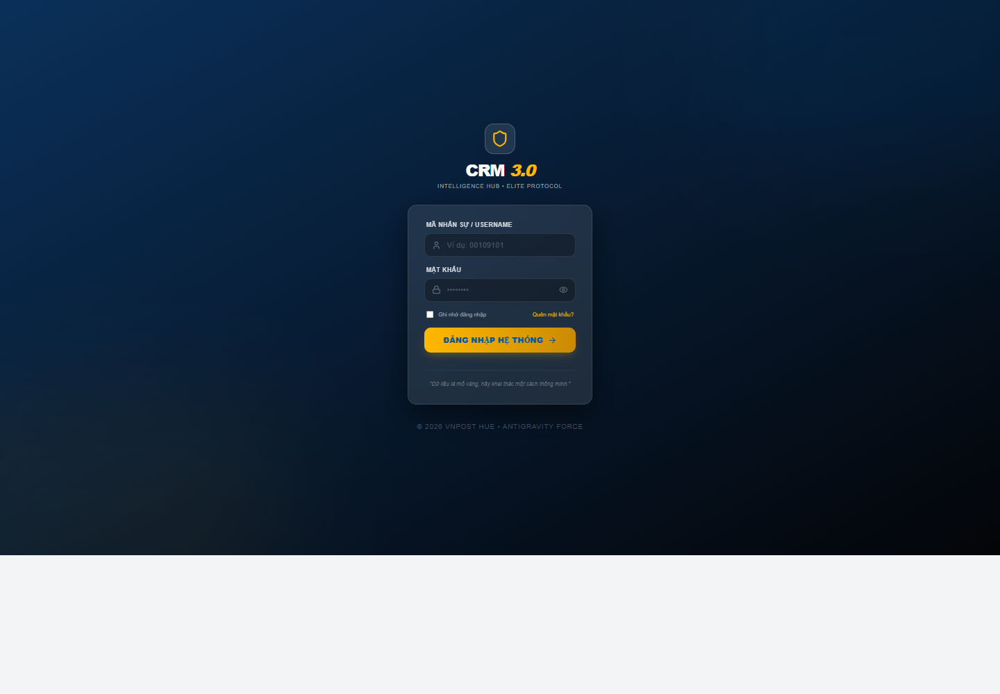
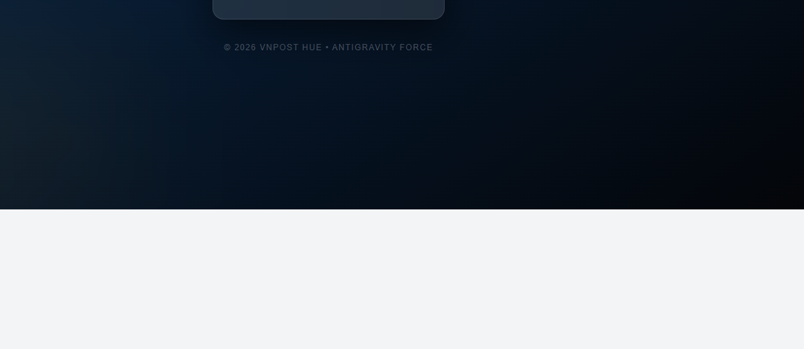
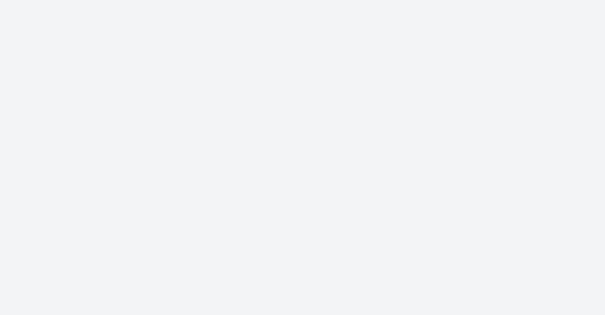
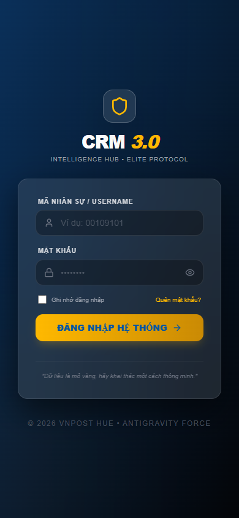

# 📸 Screenshots

*(Khu vực dành cho hình ảnh giao diện thực tế)*

- 🖼️ **Dashboard Overview (Desktop)**
  
  *Mục đích: Giúp AI hiểu tổng layout và visual hierarchy. (Section: Toàn cảnh Dashboard)*

- 🖼️ **KPI Section & Population Cards**
  
  *Mục đích: Giúp AI audit KPI density, spacing, color semantics. (Section: Khu vực KPI Cards)*

- 🖼️ **Trend Charts & Analytics**
  
  *Mục đích: Giúp AI audit chart readability và consistency. (Section: Khu vực Biểu đồ xu hướng)*

- 🖼️ **Heatmap Tables & Performance**
  
  *Mục đích: Giúp AI audit responsive/table UX issues, xem xét tình trạng overflow và data density. (Section: Bảng dữ liệu Heatmap)*

- 🖼️ **Dashboard Overview (Mobile)**
  
  *Mục đích: Giúp AI hiểu responsive debt hiện tại, đặc biệt kiểm tra các block có bị tràn viền (overflow-x) trên màn hình nhỏ hay không.*
